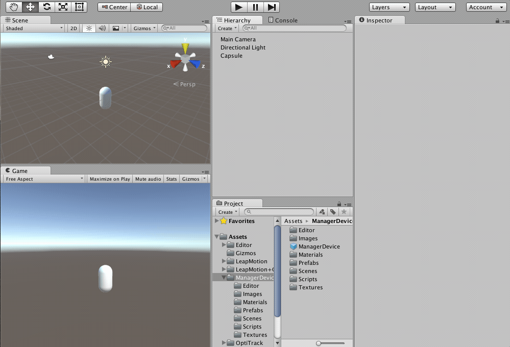

# VR Plugin for Unity

## Introduction

Newcomers to the **Decoroso Crespo Laboratory**, who join new groups to develop VR software using **Unity** as a development platform, find it difficult to integrate some of the devices the laboratory has, such as **Oculus**, **Leap Motion**, **Gamepad**, **Stereowall** and **3D Mouse**. 

They must learn to master Unity on their own and then integrate the devices they need to use in the project. This process can take time for a newcomer, and time spent in digesting this knowledge and then implementing the development project can affect the duration of the project itself. This project is a contribution for these groups to save time when starting a project in **Unity**, through a plugin that can transparently configure the devices that they want to use in the project, minimizing the effort and time spent in configuring and integrating these devices independently.

## How to use this plugin

## Installation

### Option 1
- To use this plugin clone this repo using:   
`git clone https://github.com/jtroya/Decoroso-Crespo-VR-Plugin-For-Unity.git`

- This repo is a empty Unity project ready to use. The version of Unity used is **_5.1.1f1_**

### Option 2
- [Download](https://mega.nz/#!Al1Q2YDZ!htDW-pr3h9Y6v4ZPZrGfUtKu84KLx6py1536wfjpCT4) the Unity Package to install in new project.
- Import the custom package (Assets / Import Package / Custom Package...).
- Select all the options to import.

>To get an idea how to install this plugin, please watch this video.  

